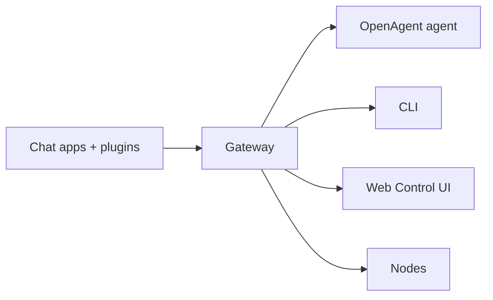

# OpenAgent

<p align="center">
    
</p>

<p align="center">
  <strong>Your AI assistant, on your own hardware, in the chat apps you already use.</strong><br />
  One Gateway. Any model. Any device. No hosted service in the middle.<br />
  A course edition by Celaya Solutions, derived from OpenClaw. No paid tier, and no <a href="/gateway/telemetry">telemetry</a> unless you configure an endpoint.
</p>

<Columns>
  <Card title="Get Started" href="/start/getting-started" icon="rocket">
    Install OpenAgent and bring up the Gateway in minutes.
  </Card>
  <Card title="Run Onboarding" href="/start/wizard" icon="list-checks">
    Guided setup with `openagent onboard` and pairing flows.
  </Card>
  <Card title="Connect a Channel" href="/channels" icon="message-circle">
    Link Discord or Telegram to chat from anywhere.
  </Card>
  <Card title="Open the Control UI" href="/web/control-ui" icon="layout-dashboard">
    Launch the browser dashboard for chat, config, and sessions.
  </Card>
</Columns>

## Browse docs

Mobile browsers may show the section menu without the full desktop tab bar. Use
these hub links to reach the same top-level docs areas from the page body.

<Columns>
  <Card title="Get started" href="/start/getting-started" icon="rocket">
    Overview, first steps, and setup guides.
  </Card>
  <Card title="Install" href="/install" icon="download">
    Install paths, updates, containers, hosting, and advanced setup.
  </Card>
  <Card title="Channels" href="/channels" icon="messages-square">
    Messaging channels, pairing, routing, and access groups.
  </Card>
  <Card title="Agents" href="/concepts/architecture" icon="bot">
    Architecture, sessions, context, memory, and multi-agent routing.
  </Card>
  <Card title="Capabilities" href="/tools" icon="wand-sparkles">
    Tools, skills, cron, webhooks, and automation capabilities.
  </Card>
  <Card title="Models" href="/providers" icon="brain">
    Providers, model configuration, failover, and local model services.
  </Card>
  <Card title="Platforms" href="/platforms" icon="monitor-smartphone">
    Linux, Windows, nodes, and web surfaces.
  </Card>
  <Card title="Gateway & Ops" href="/gateway" icon="server">
    Gateway configuration, security, diagnostics, and operations.
  </Card>
  <Card title="Reference" href="/cli" icon="terminal">
    CLI reference, schemas, RPC, and templates.
  </Card>
  <Card title="Help" href="/help" icon="life-buoy">
    Troubleshooting, FAQs, testing, diagnostics, and environment checks.
  </Card>
</Columns>

## What is OpenAgent?

OpenAgent is a **self-hosted gateway** that connects chat apps — Discord and Telegram, plus the browser Control UI — to AI coding agents. You run a single Gateway process on your own machine (or a server), and it becomes the bridge between your messaging apps and an always-available AI assistant.

**Who is it for?** Developers, power users, and teams who want an AI assistant they can message from anywhere — without giving up control of their data or relying on a hosted service. The same gateway runs as a personal assistant on one laptop or as a shared [team deployment](/start/teams); configuration is the only difference.

**What makes it different?**

- **Self-hosted**: runs on your hardware, your rules
- **Multi-channel**: one Gateway serves every configured channel plugin simultaneously
- **Agent-native**: built for coding agents with tool use, sessions, memory, and multi-agent routing
- **Open source**: MIT licensed, built from source

The full architecture case — a trusted gateway, untrusted execution, deterministic policy, and how one product spans personal and team use — is in [Why OpenAgent](/start/why-openclaw).

**What do you need?** Node 26 (recommended), or another supported release: Node 24.16+ or Node 26.1+. You also need an API key from your chosen provider and 5 minutes. For best quality and security, use the strongest latest-generation model available.

## How it works



The Gateway is the single source of truth for sessions, routing, and channel connections.

## Key capabilities

<Columns>
  <Card title="Multi-channel gateway" icon="network" href="/channels">
    Discord, Telegram, and WebChat with a single Gateway process.
  </Card>
  <Card title="Multi-agent routing" icon="route" href="/concepts/multi-agent">
    Isolated sessions per agent, workspace, or sender.
  </Card>
  <Card title="Media support" icon="image" href="/nodes/images">
    Send and receive images, audio, and documents.
  </Card>
  <Card title="Web Control UI" icon="monitor" href="/web/control-ui">
    Browser dashboard for chat, config, sessions, and nodes.
  </Card>
  <Card title="Nodes" icon="server" href="/nodes">
    Pair headless node hosts to run commands on other machines.
  </Card>
  <Card title="Skills" icon="graduation-cap" href="/tools/skills">
    Teach the agent repeatable procedures it loads on demand.
  </Card>
  <Card title="Automation" icon="clock" href="/automation">
    Run work on a schedule with cron jobs, hooks, and webhooks.
  </Card>
  <Card title="Build plugins" icon="hammer" href="/plugins/building-plugins">
    Write your own channel, provider, and tool plugins against the plugin SDK.
  </Card>
</Columns>

## Quick start

<Steps>
  <Step title="Install OpenAgent">
    ```bash
    git clone https://github.com/celaya-solutions/CSR-AGENT.git
    cd CSR-AGENT
    pnpm install && pnpm build && pnpm ui:build
    pnpm openagent onboard
    ```

    OpenAgent installs from source only. Docker, Podman, and the optional
    global `openclaw` command are on the [Install](/install) page.

  </Step>
  <Step title="Complete onboarding">
    Onboarding offers **Quick start** and **Custom setup**. Quick start reuses
    detected AI access, verifies it with a real completion, and opens the web
    dashboard with a Gateway in the foreground. Custom setup walks the full
    guided flow. `openagent onboard --classic` opens the classic step-by-step
    wizard instead.

  </Step>
  <Step title="Install the Gateway service">
    Quick start leaves the Gateway in the foreground. Press **Ctrl+C**, then
    install the background service:

    ```bash
    openagent gateway install
    ```

  </Step>
  <Step title="Chat">
    Open the Control UI in your browser and send a message:

    ```bash
    openagent dashboard
    ```

    Or connect a channel ([Telegram](/channels/telegram) is fastest) and chat from your phone.

  </Step>
</Steps>

Need the full install and dev setup? See [Getting Started](/start/getting-started).

## Dashboard

Open the browser Control UI after the Gateway starts.

- Local default: [http://127.0.0.1:18789/](http://127.0.0.1:18789/)
- Remote access: [Web surfaces](/web) and [Tailscale](/gateway/tailscale)

## Configuration (optional)

Config lives at `~/.openclaw/openclaw.json`.

- If you **do nothing**, OpenAgent uses the bundled OpenAgent agent runtime; DMs share the agent's main session, and each group chat gets its own session.
- If you want to lock it down, start with `channels.telegram.allowFrom` and (for groups) mention rules.

Example:

```json5
{
  channels: {
    telegram: {
      allowFrom: ["123456789"],
      groups: { "*": { requireMention: true } },
    },
  },
  messages: { groupChat: { mentionPatterns: ["@openclaw"] } },
}
```

## Start here

<Columns>
  <Card title="Docs hubs" href="/start/hubs" icon="book-open">
    All docs and guides, organized by use case.
  </Card>
  <Card title="Configuration" href="/gateway/configuration" icon="settings">
    Core Gateway settings, tokens, and provider config.
  </Card>
  <Card title="Remote access" href="/gateway/remote" icon="globe">
    SSH and tailnet access patterns.
  </Card>
  <Card title="Channels" href="/channels" icon="message-square">
    Channel-specific setup for Discord and Telegram.
  </Card>
  <Card title="Nodes" href="/nodes" icon="server">
    Headless node hosts with pairing and remote command execution.
  </Card>
  <Card title="Help" href="/help" icon="life-buoy">
    Common fixes and troubleshooting entry point.
  </Card>
</Columns>

## Learn more

<Columns>
  <Card title="Full feature list" href="/concepts/features" icon="list">
    Complete channel, routing, and media capabilities.
  </Card>
  <Card title="Multi-agent routing" href="/concepts/multi-agent" icon="route">
    Workspace isolation and per-agent sessions.
  </Card>
  <Card title="Security" href="/gateway/security" icon="shield">
    Tokens, allowlists, and safety controls.
  </Card>
  <Card title="Troubleshooting" href="/gateway/troubleshooting" icon="wrench">
    Gateway diagnostics and common errors.
  </Card>
  <Card title="About and credits" href="/reference/credits" icon="info">
    Project origins, attribution, and license.
  </Card>
</Columns>
